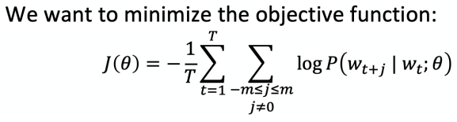
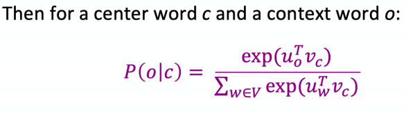
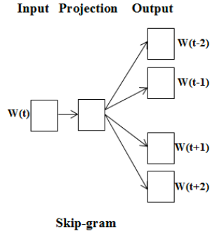
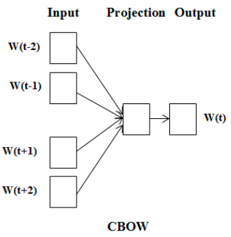
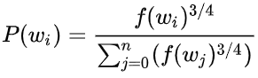
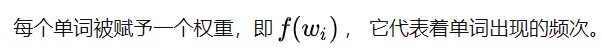

##  word2vec

+ Word2vec 是从大规模文本语料中以无监督的方式学习语义知识的一种模型，它通过学习文本，用词向量的方式表征词的语义信息。即构建一个嵌入空间，使语义相似的词在该空间内距离相近。

### objective function

+ softmax中"max"是指放大最大值的概率，soft是指对更小的x仍然分配某个概率值

### skim-gram

### CBOW

+ 针对word2vec中计算量比较大的问题，提出了两种解决办法，层级softmax与负采样。

### Hierarchical Softmax

+ 根据标签（label）和频率建立霍夫曼树；（label出现的频率越高，Huffman树的路径越短）
+ Huffman树中每一叶子结点代表一个label

### Negative Sampling

### word2vector in practice

+ Speed up with Annoy  
+ Tencent Chinese Embedding  
+ 利用whatlies探索Embedding