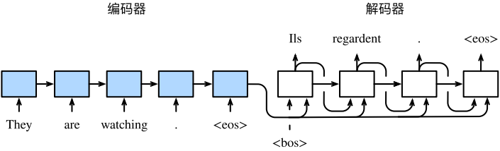
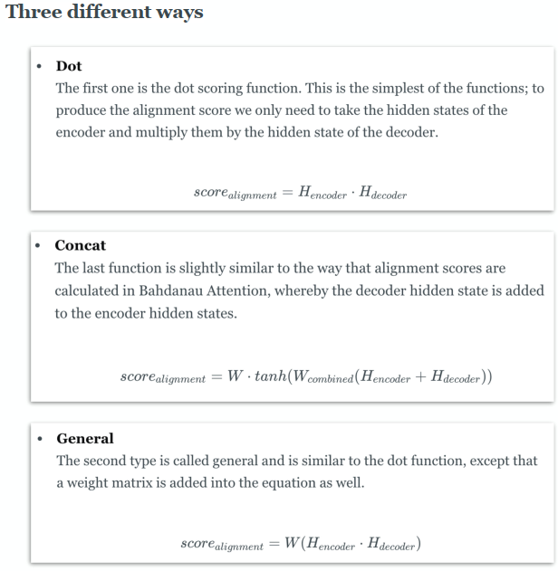
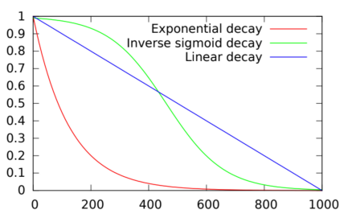

## Text Summarization  介绍

+ 抽取式文本摘要（Extractive Summarization  ）
+ 抽象式文本摘要（Abstractive Summarization  ）

## Text Rank  

+ 类似于PageRank算法，TextRank算法是一种抽取式的无监督的文本摘要方法

TextRank 算法是一种用于文本的基于图的排序算法，通过把文本分割成若干组成单元（句子），构建节点连接图，用句子之间的相似度作为边的权重，通过循环迭代计算句子的TextRank值，最后抽取排名高的句子组合成文本摘要。

## Seq2seq Architecture  

### RNN

+ 缓解梯度消失问题

          1. 选择合适的激活函数，比如ReLU，像sigmoid函数与Tanh函数有比较大的梯度饱和区域，使得梯度的取值接近于1
          2. 残差连接
          3. BatchNorm
          4. 在RNN网络中可以通过LSTM来解决信息遗忘与梯度传播的问题
   
+ 缓解梯度爆炸问题

     1. 梯度裁剪
     2. Truncated BPTT

RNN的优势是可以处理序列数据以及参数共享，RNN的劣势是训练困难、无法处理长序列、梯度消失与梯度爆炸

### LSTM

遗忘门、输入门、输出门

### GRU

+ LSTM的简化版本，参数更少。

### seq2seq

+ additive attention

+ multiplicative attention

## training skills

+ cross entropy loss
+ 强制教学（Teacher Forcing）

+ Teacher Forcing的优势是收敛速度快，缺点是训练阶段与测试阶段不一致（Exposure Bias）

+ Exposure Bias的解决办法是Beamsearch与scheduled sampling（以一定概率决定使用ground truth还是模型前一个预测值，训练初始阶段以较大概率选择ground truth，随后减小）

