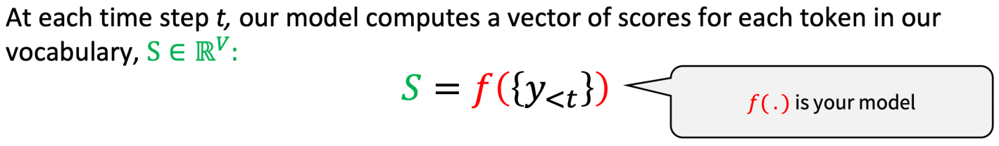

## NLG Intro

+ 应用：机器翻译、对话系统、document summarization、E-mail ssummarization、meeting summarization等

### how  to decode

#### greedy decoding

+ beam decoding(预定义最大的时间步或者最少的生成结果来定义结束)

+ beamsearch中k的选择：K越小，计算量越小，k=1时等同于贪心算法，K越小，越容易出现语法问题，句子不通顺。K越大，计算量越大，K越大容易出现句子长度短的现象。

**上述公式会惩罚长句子（概率小于1，越乘越小）**

**解决办法（Normalize）**

+ 阿尔法的推荐值是0.5-0.7

**重复问题解决办法（Repetitive Problem）**

+ Don't repeat n-grams （通过代码强制）
+ 修改损失函数，降低隐藏状态的相似度

+ Unlikelihood Training

+ F2 Softmax  

通过分解softmax来避免重复，首先根据频率将token分为若干类，在训练的时候学习预测频率类别与词典token。

#### Sampling Strategy  

+ Temperature Scaling  

**t越小长尾词被选择的概率越小**

+ top k sampling

在概率最高的前k个候选词中sampling。Top-k Sampling存在的问题是，常数k是提前给定的值，对于长短大小不一，语境不同的句子，我们可能有时需要比k更多的tokens。

+ top p sampling（nuclear sampling）

p是percent，按照百分比采样。本质上Top-p Sampling和Top-k Sampling都是从truncated vocabulary distribution中sample token，区别在于置信区间的选择。通常top k与top p同时使用。

## Evaluate Metrics  

+ ROUGE-N

ROUGE-N度量模型生成文本中n-gram与label中n-gram匹配的数量。

ROUGE-N的优点是直观，简洁，能反映词序。缺点是区分度不高，且当N>3时，ROUGE-N值通常很小。常用ROUGE-1与ROUGE-2

+ ROUGE-L

ROUGE-L度量模型生成文本与label文本的最长公共子序列。

+ ROUGE-S

S指skip-gram。使用了skip-grams，在参考摘要和待评测摘要进行匹配时，不要求gram之间必须是连续的，可以“跳过”几个单词，比如skip-bigram，在产生grams时，允许最多跳过两个词。比如“cat in the hat”的 skip-bigrams 就是 “cat in, cat the, cat hat, in the, in hat, the hat”。

