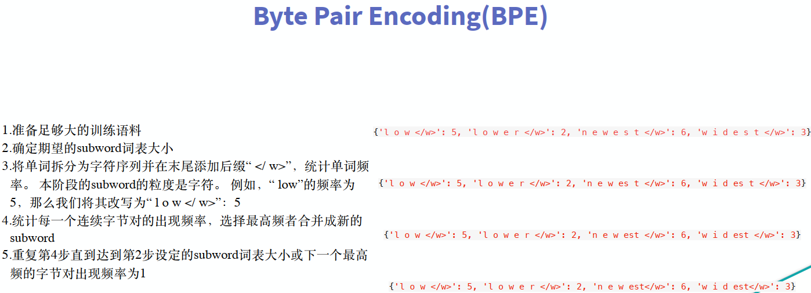
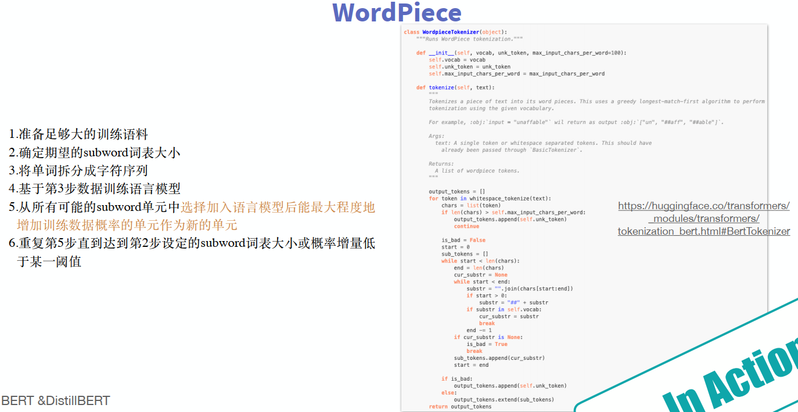
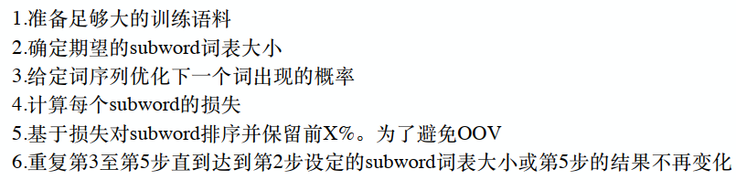
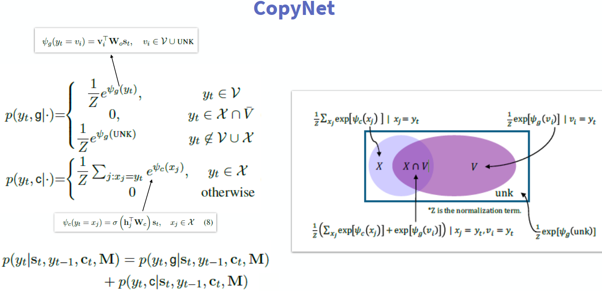
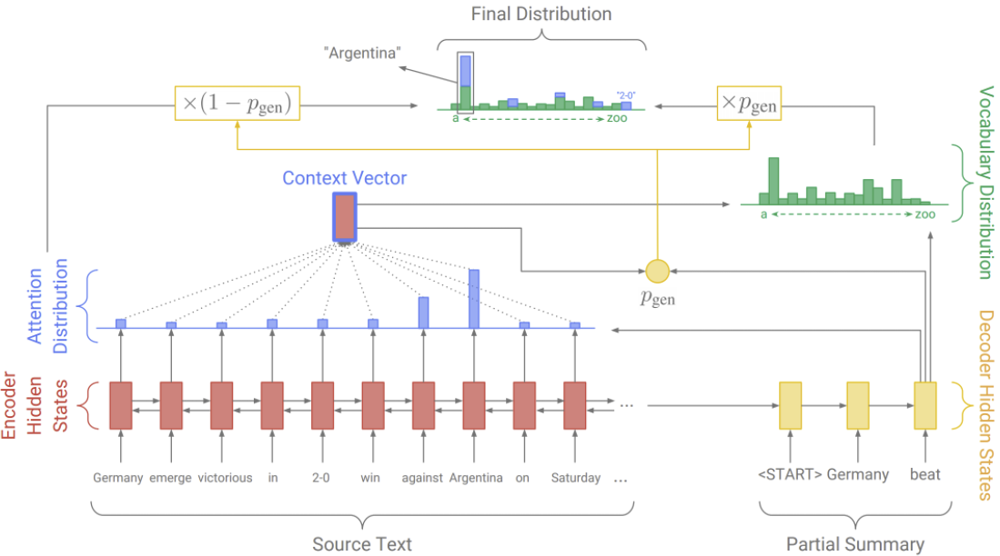
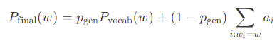
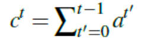
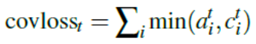

### OOV（out of vocabulary)

+ 两种情况产生OOV问题：一种是人为错误(typos)，第二种情况是训练集与测试集词表不同。

+ 解决方法：

1. ignore
2. use\<UNK\>
3. enlarge vocabulary(速度变慢了，有的单词出现次数太少，训练的词向量不准确，没有意义)
4. Individual Characters (缺乏语义信息)
5. spell check（纠正拼写错误）
6. subword

subword产生的太多解决方法：

1. 哈希算法
2. BPE（Byte Pair Encoding）

3. WordPiece

4. Unigram Language Model  

### Pointer-Generator Network  (PGN)

+ Pointer Network（Ptr-Net）

Pointer Networks正是通过对Attention Mechanism的简化而得到的。主要解决的问题是输出的字典长度不固定问题（输出字典的长度等于输入序列的长度）。它预测的时候每一步都找当前输入序列中权重最大的那个元素。传统带有注意力机制的seq2seq模型输出的是针对输出词汇表的一个概率分布，而Pointer Networks输出的则是针对输入文本序列的概率分布。Pointer Networks特别**适合用来直接复制输入序列中的某些元素给输出序列**。而事实证明，后来的许多文章也确实是以这种方式使用Pointer Networks的。

+ CopyNet

+ Pointer-Generator Network  

+ Coverage Mechanism(解决Word Repetition  )   

 The idea is that we use the attention distribution to keep track of what’s been covered so far, and penalize the network for attending to same parts again.

### hyper-Parameter Tuning  

+ 将各个参数的设置部分集中在⼀起。如果参数的设置分布在代码的各个地⽅，那么修改的过程想必会⾮常痛苦 。
+ 可以输出模型的损失函数值以及训练集和验证集上的准确率。  
+ 可以考虑设计⼀个⼦程序，可以根据给定的参数，启动训练并监控和周期性保存评估结果。再由⼀个主程序，分配参数以及并⾏启动⼀系列⼦程序。  
+ 建议先参考相关论⽂，以论⽂中给出的参数作为初始参数。⾄少论⽂中的参数，是个不差的结果。  
+ 如果找不到参考，那么只能⾃⼰尝试了。可以先从⽐较重要，对实验结果影响⽐较⼤的参数开始，同时固定其他参数，得到⼀个差不多的结果以后，在这个结果的基础上，再调其他参数。例如学习率⼀般就⽐正则值，dropout值重要的话，学习率设置的不合适，不仅结果可能变差，模型甚⾄会⽆法收敛。  
+ 如果实在找不到⼀组参数让模型收敛。那么就需要检查，是不是其他地⽅出了问题，例如模型实现，数据等等。  
+ 对训练数据进⾏采样。例如原来100W条数据，先采样成1W，进⾏实验看看。  
+ 减少训练类别。例如⼿写数字识别任务，原来是10个类别，那么我们可以先在2个类别上训练，看看结果如何。  
+ 建议优先在对数尺度上进⾏超参数搜索。⽐较典型的是学习率和正则化项，我们可以从诸如0.001 0.01 0.1 1 10，以10为阶数进⾏尝试。因为他们对训练的影响是相乘的效果。不过有些参数，还是建议在原始尺度上进⾏搜索，例如dropout值: 0.3 0.5 0.7)。  
+ 每层结点数： 16 32 128，超过1000的情况⽐较少见。超过1W的从来没有见过。  
+ batch size: 128上下开始。batch size值增加，的确能提⾼训练速度。但是有可能收敛结果变差。如果显存⼤⼩允许，可以考虑从⼀个⽐较⼤的值开始尝试。因为batch size太⼤，⼀般不会对结果有太⼤的影响，⽽batch size太⼩的话，结果有可能很差。  
+ 词向量embedding⼤⼩：128，256  。
+ L2正则：1.0，超过10的很少见。  
+ dropout： 0.5  
+ clip c(梯度裁剪): 限制最⼤梯度,其实是value = sqrt(w1^2+w2^2….),如果value超过了阈值，就算⼀个衰减系系数,让value的值等于阈值: 5,10,15  