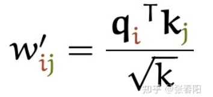
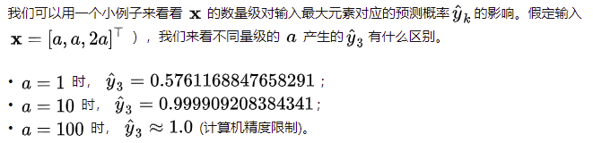
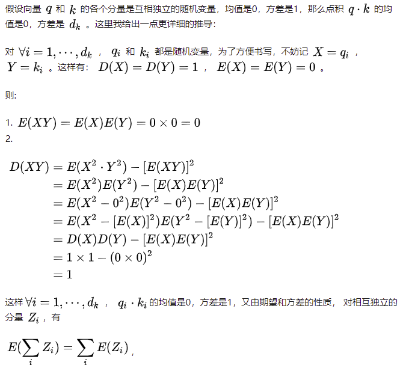
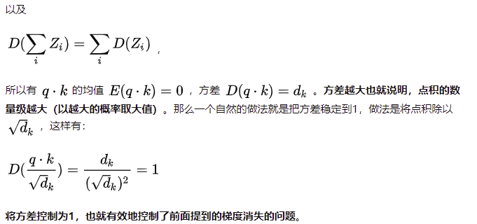
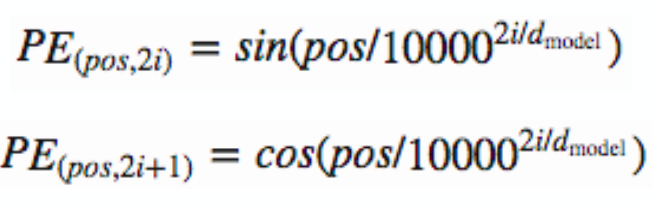

## Transformer

### 除以 $ \sqrt{k} $的原因是：

​      1.    **向量的点积结果会很大，将softmax函数push到梯度很小的区域，scaled会缓解这种现象 **

​       2. **维度与点积大小的关系是怎么样的，为什么使用维度的根号来放缩？**

### **Transformer为何使用多头注意力机制？（为什么不使用一个头）**

+ 将模型分为多个头，形成多个子空间，可以让模型去关注不同方面的信息

如果令Q=K，那么得到的模型大概率会得到一个类似单位矩阵的attention矩阵，**这样self-attention就退化成一个point-wise线性映射**。这样至少是违反了设计的初衷。使用Q/K/V不相同可以保证在不同空间进行投影，增强了表达能力，提高了泛化能力。

### **Transformer计算attention的时候为何选择点乘而不是加法？两者计算复杂度和效果上有什么区别？**

+ 为了计算更快。矩阵加法在加法这一块的计算量确实简单，但是作为一个整体计算attention的时候相当于一个隐层，整体计算量和点积相似。在效果上来说，从实验分析，两者的效果和dk相关，dk越大，加法的效果越显著。

### **在计算attention score的时候如何对padding做mask操作？**

+ padding位置置为负无穷(一般来说-1000就可以)

### Position Encoding

+ Position Encoding  规律：维度越高，值越趋于一致。