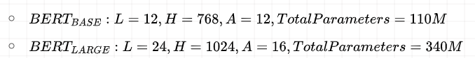

## BERT

+ 传统的word2vec无法解决一词多义问题，无法表达词的多层信息。
+ BERT的低层网络就学习到了短语级别的信息表征，BERT的中层网络就学习到了丰富的语言学特征，而BERT的高层网络则学习到了丰富的语义信息特征。

### BERT的基本原理是什么？

> BERT 是Google在2018年提出的语言模型，是Bidirection Encoder Representation from Transformers的首字母缩写，整体是一个自编码语言模型，并且设计了两个任务来预训练该模型。
>
> + 第一个任务是MaskLM，在输入一句话的时候随机选取一些要预测的词（15%），然后用一个特殊的符号[mask]来代替它们，然后让模型根据上下文信息预测被mask的单词。思想来源于**「完形填空」**，这么做有两个缺点，一个是在后续微调任务中语句中并不会出现 [MASK] 标记，另一个缺点是每批次数据中只有 15% 的标记被预测，这意味着模型可能需要更多的预训练步骤来收敛。
> + 第二个任务是句子级别的连续性预测任务，预测输入BERT的两段文本是否为连续文本，引入这个任务可以让模型更好的学习到连续文本片段之间的关系
> + BERT相较于传统的RNN、LSTM模型可以做到并发执行。

### BERT 是怎么用 Transformer 的？

> BERT只使用了Transformer中的encoder，原论文中作者分别使用了12层和24层Transformer

### MaskLM任务中80%、10%、10%划分的原因是什么，为什么不全mask？

> 一个原因是微调任务中不会出现[mask]标记，另一个原因是模型不知道当前需要预测单词对应的token是否为正确单词，这就迫使模型更多依赖上下文信息去预测词汇，并且赋予了模型一定的纠错能力。

### 为什么 BERT 比 ELMo 效果好？

> + LSTM提取特征的能力远弱于transformer
> + 拼接方式双向融合的特征融合能力偏弱
> + BERT的训练数据以及模型参数远大于ELMo

### ELMo 和 BERT 的区别是什么？

ELMo通过语言模型得到单词的embedding， ELMO 给下游提供的是每个单词的特征形式，所以这一类预训练的方法被称为“Feature-based Pre-Training”。而 BERT 模型是“基于 Fine-tuning 的模式”

### BERT 有什么局限性？

> + BERT 在分词后做[MASK]会产生的一个问题，为了解决 OOV 的问题，我们通常会把一个词切分成更细粒度的 WordPiece。BERT 在 Pretraining 的时候是随机 Mask 这些 WordPiece 的，这就可能出现只 Mask 一个词的一部分的情况.
> + NSP任务后来被证明对模型效果影响不大
> + BERT 的在预训练时会出现特殊的[MASK]，但是它在下游的 fine-tune 中不会出现，这就出现了预训练阶段和 fine-tune 阶段不一致的问题