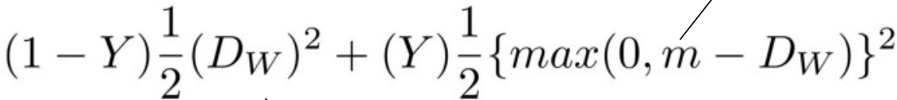

## Siamese Network  （孪生网络）

+ 共享参数，孪生网络用来衡量两个输入的相似程度。
+ Contrastive Loss Function  ，⽬标是让两个相似的输⼊距离尽可能的⼩，两个不同类别的输⼊距离尽可能的⼤  。

+ Triple Siamese  

## matchsum

+ 传统抽取式摘要模型都是基于句子级提取的，对所有句子逐个打分，最后取topn的句子为摘要，未曾考虑句子间的关系。如果仅以句子级提取，容易产生pearl-summary, 即虽然句子得分较低，但其实是较好的摘要，作者称为沧海遗珠。
+ matchsum考虑句子间的关系，通过候选句间的组合句来抽取摘要。基于摘要与原文档在语义上应该有较大匹配度的考量，本文提出了基于候选句间的组合句与原文档的相似度来判断文档摘要的模型。
+ 损失函数分为两部分：

      1. 基于候选摘要与原文档的相似度

2. 考虑候选摘要之间的差异性，即基于margin loss的思想，认为得分靠前的与得分排后的有较大的差民，其损失函数可表示为

+ **Pearl-Summary**: 指的是虽有较低的sentence-level分数，但有很高的summary-level分数，如作者所说，有沧海遗珠的意思。
+ **Best-Summary**：指的是在所有候选摘要中，summary-level分数最高。

## Don't Stop Pretraining  

### Domain Adaptive Pretraining(DAPT)  
+ 在预训练完成的语⾔模型RoBERTa的基础上，分别使⽤4个领域的数据接着做第⼆阶段的预训练，⽣成4个领域⾃适应的语⾔模型  

### Task Adaptive Pretraining(TAPT)  
+ 将各个任务本身的训练数据当作⽆标签数据来进⾏第⼆阶段的预训练，得到8个任务⾃适应的预训练语⾔模型  ，与DAPT相⽐， TAPT使⽤的是更⼩的，但与⽬标任务更相关的预训练数据集。  

+ TAPT的效果不如DAPT，TAPT与DAPT也可以联合使用。

## 模型压缩

+ Knowledge Distillation  

+ 量化

