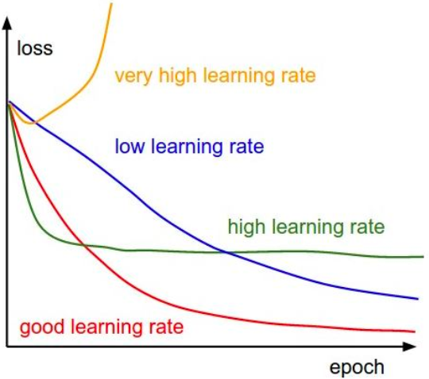

## 深度学习模型训练过程

### 数据准备

+ 数据标注前的标签体系设定要合理，用于标注的数据集需要无偏、全面、尽可能均衡，标注过程要审核。
+ 将各个标签的数据放于不同的文件夹中，并统计各个标签的数目，样本均衡，样本不会绝对均衡，差不多就行了。
+ 切分样本集。如：90%用于训练，10%留着测试，比例自己定。训练集合，对于弱势类要重采样，训练中要保证样本均衡，学习到弱势类的特征，测试过程要反应真实的数据集分布。

### 基本步骤

+ 定义算法公式，也就是神经网络的前向算法。我们一般使用现成的网络，如inceptionV4，mobilenet等。
+ 定义loss，选择优化器，来让loss最小
+ 对数据进行迭代训练，使loss到达最小
+ 在测试集或者验证集上对准确率进行评估

### 训练

+ 刚开始训练不要使用所有数据，首先尝试过拟合一个小数据集
+ 尝试使用不同的学习率策略

### 调整参数

+ 神经⽹络的训练过程中，不可避免地要和很多超参数打交道，需要⼿动设定，⼤致包括：初始学习率 、学习率衰减程度 、正则化系数/强度(包括l2正则化强度，dropout⽐例)。
+ 学习率是⼀个⾮常⾮常重要的超参数，这个参数呢，⾯对不同规模、不同batch-size、不同优化⽅式、不同数据集，其最合
  适的值都是不确定的，我们⽆法光凭经验来准确地确定lr的值，我们唯⼀可以做的，就是在训练中不断寻找最合适当前状态
  的学习率。

+ ⼀般来说，越⼤的batch-size使⽤越⼤的学习率。越⼤的batch-size意味着我们学习的时候，收敛⽅向的confidence越⼤，我们前进的⽅向更加坚定，⽽⼩的
  batch-size则显得⽐较杂乱，毫⽆规律性，因为相⽐批次⼤的时候，批次⼩的情况下⽆法照顾到更多的情况，所以需要⼩的学习率来保证不⾄于出错。

+ 如果训练发现Loss不下降，检查数据的输⼊是否正常， data和label是否⼀致  ，考虑⽹络架构的选择，⼀般是越深越好，但是也分数据集。 并且
  ⽤不⽤在⼤数据集上pre-train的参数也很重要的，检查loss function 对不对  
+ 在任何⼀个深度学习任务中，我们都会遇到⼀些⽐较“棘⼿”的数据，这些数据相⽐较于其他的普通数据更难识别，这种特别容易识别错误的例⼦就称为hard-negative。  对于这些数据，可以先⽤初始的正负样本(⼀般是正样本+与正样本同规模的负样本的⼀个⼦集)训练分类器, 然后再⽤训练出的分类器对样本进⾏分类, 把其中负样本中错误分类的那些样本(hard negative)放⼊负样本集合, 再继续训练分类器, 如此反复, 直到达到停⽌条件(⽐如分类器性能不再提升)。也就是不停的将困难样本拿去训练，让分类器更好地学习到难以学习的特征，简单来说就是熟能⽣巧。