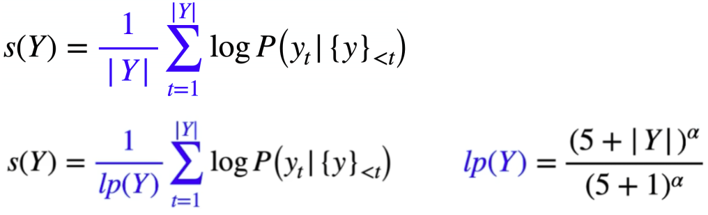

### 回顾

#### greedy decoding

+ 返回概率最大的token

```python
# greedy decoder
def greedy_decoder(data):
    # 每一行最大概率词的索引
    return [argmax(s) for s in data]
```

#### beam search

> 与greedy search不同，beam search返回多个最有可能的解码结果（具体多少个，由参数k执行）。greedy search每一步都都采用最大概率的词，而beam search每一步都保留k个最有可能的结果，在每一步，基于之前的k个可能最优结果，继续搜索下一步。beamsearch中k的选择：K越小，计算量越小，k=1时等同于贪心算法，K越小，越容易出现语法问题，句子不通顺。K越大，计算量越大，K越大容易出现句子长度短的现象。

+ 修正后的beam search



#### Top-k sampling

> 在概率最高的前k个候选词中sampling。Top-k Sampling存在的问题是，常数k是提前给定的值，对于长短大小不一，语境不同的句子，我们可能有时需要比k更多的tokens。

#### Top-p sampling（nuclear sampling）

> p是percent，按照百分比采样。本质上Top-p Sampling和Top-k Sampling都是从truncated vocabulary distribution中sample token，区别在于置信区间的选择。通常top k与top p同时使用。

#### eval metric

+ ROUGE-N

> ROUGE-N度量模型生成文本中n-gram与label中n-gram匹配的数量。ROUGE-N的优点是直观，简洁，能反映词序。缺点是区分度不高，且当N>3时，ROUGE-N值通常很小。常用ROUGE-1与ROUGE-2

+ ROUGE-L

> ROUGE-L度量模型生成文本与label文本的最长公共子序列。

+ ROUGE-S

> S指skip-gram。使用了skip-grams，在参考摘要和待评测摘要进行匹配时，不要求gram之间必须是连续的，可以“跳过”几个单词，比如skip-bigram，在产生grams时，允许最多跳过两个词。比如“cat in the hat”的 skip-bigrams 就是 “cat in, cat the, cat hat, in the, in hat, the hat”。

#### hyper-Parameter Tuning

- 将各个参数的设置部分集中在⼀起。如果参数的设置分布在代码的各个地⽅，那么修改的过程想必会⾮常痛苦 。
- 可以输出模型的损失函数值以及训练集和验证集上的准确率。
- 可以考虑设计⼀个⼦程序，可以根据给定的参数，启动训练并监控和周期性保存评估结果。再由⼀个主程序，分配参数以及并⾏启动⼀系列⼦程序。
- 建议先参考相关论⽂，以论⽂中给出的参数作为初始参数。⾄少论⽂中的参数，是个不差的结果。
- 如果找不到参考，那么只能⾃⼰尝试了。可以先从⽐较重要，对实验结果影响⽐较⼤的参数开始，同时固定其他参数，得到⼀个差不多的结果以后，在这个结果的基础上，再调其他参数。例如学习率⼀般就⽐正则值，dropout值重要的话，学习率设置的不合适，不仅结果可能变差，模型甚⾄会⽆法收敛。
- 如果实在找不到⼀组参数让模型收敛。那么就需要检查，是不是其他地⽅出了问题，例如模型实现，数据等等。
- 对训练数据进⾏采样。例如原来100W条数据，先采样成1W，进⾏实验看看。
- 减少训练类别。例如⼿写数字识别任务，原来是10个类别，那么我们可以先在2个类别上训练，看看结果如何。
- 建议优先在对数尺度上进⾏超参数搜索。⽐较典型的是学习率和正则化项，我们可以从诸如0.001 0.01 0.1 1 10，以10为阶数进⾏尝试。因为他们对训练的影响是相乘的效果。不过有些参数，还是建议在原始尺度上进⾏搜索，例如dropout值: 0.3 0.5 0.7)。
- 每层结点数： 16 32 128，超过1000的情况⽐较少见。超过1W的从来没有见过。
- batch size: 128上下开始。batch size值增加，的确能提⾼训练速度。但是有可能收敛结果变差。如果显存⼤⼩允许，可以考虑从⼀个⽐较⼤的值开始尝试。因为batch size太⼤，⼀般不会对结果有太⼤的影响，⽽batch size太⼩的话，结果有可能很差。
- 词向量embedding⼤⼩：128，256 。
- L2正则：1.0，超过10的很少见。
- dropout： 0.5
- clip c(梯度裁剪): 限制最⼤梯度,其实是value = sqrt(w1^2+w2^2….),如果value超过了阈值，就算⼀个衰减系系数,让value的值等于阈值: 5,10,15